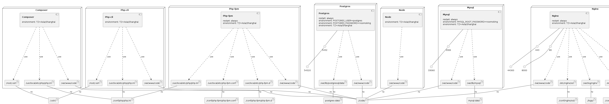

# docker-compose-laravel

[](https://www.murphysec.com/console/report/1674336661792382976/1674336661876269056)

用于 laravel 开发的 docker-compose 运行环境

**常用的 Docker 操作命令：**
```
# 拉取 全部/部分 镜像
docker-compose pull
docker-compose pull nginx php-fpm php-fpm-5 php-fpm-8
# 构建，启动项目中的 全部/部分 服务容器（建议先拉取镜像，这样会跳过构建过程）
docker-compose up -d
docker-compose up -d nginx php-fpm php-fpm-5 php-fpm-8
# 重启项目中的 全部/部分 服务容器
docker-compose restart
docker-compose restart nginx php-fpm php-fpm-5 php-fpm-8
# 停止并移除项目中的 全部/部分 服务容器
docker-compose rm -f -s
docker-compose rm -f -s nginx php-fpm php-fpm-5 php-fpm-8
# 列出项目中的服务容器
docker-compose ps
# 查看项目中的服务容器内运行的进程
docker-compose top
# 进入项目中正在运行的服务容器
docker-compose exec php-fpm bash
docker-compose exec php-fpm-5 bash
docker-compose exec php-fpm-8 bash
# 启动并进入项目中的服务容器，--rm 表示退出容器后自动删除容器
docker-compose run --rm php-cli bash
docker-compose run --rm php-cli-5 bash
docker-compose run --rm php-cli-8 bash
......
```

**提供的 Docker 容器服务：**
 - `mysql` 8.0.31
  >- 端口：33060 -> 转发到 3306
  >- 用户名：root
  >- 密码：nosmoking
 - `postgres` 12.4
  >- 端口：54320 -> 转发到 5432
  >- 用户名：postgres
  >- 密码：nosmoking
 - `mongo` 7.0.4
  >- 端口：27017 -> 转发到 27017
  >- 用户名：root
  >- 密码：nosmoking
 - `redis` 5.0.9
  >- 端口：63790 -> 转发到 6379
 - `memcached` 1.6.22-alpine
  >- 端口：11211 -> 转发到 11211
 - `phpredisadmin`
  >- 端口：6380 -> 转发到 6380
  >- 用户名：admin
  >- 密码：nosmoking
 - `beanstalkd` 1.10
  >- 端口：11300 -> 转发到 11300
 - `beanstalkd-console`
  >- 端口：2080 -> 转发到 2080
  >- 用户名：admin
  >- 密码：nosmoking
 - `gearmand` 1.1.19.1
  >- 端口：4730 -> 转发到 4730
 - `php-fpm` 7.4.33
 - `php-fpm-5` 5.6.40
 - `php-fpm-8` 8.2
 - `php-cli` 7.4.33
 - `php-cli-5` 5.6.40
 - `php-cli-8` 8.2
 - `nginx` 1.18.0
  >- 端口：8000 -> 转发到 80
  >- 端口：44300 -> 转发到 443
 - `composer` latest-stable
 - `node` lts

**使用 phpRedisAdmin 管理工具：**
 - 用PHP编写的用于管理Redis数据库的简单Web界面。
 - 访问地址：`http://127.0.0.1:6380`（其中 127.0.0.1 为Docker容器可访问IP）
 - 访问用户名、密码：`admin nosmoking`
 - 添加Redis数据库：
```
 # 修改 docker-compose.yml 文件，在 phpredisadmin 容器服务里设置环境变量，示例如下：
    environment:
      - TZ=Asia/Shanghai
      - ADMIN_USER=admin
      - ADMIN_PASS=nosmoking
      - REDIS_1_HOST=redis
      - REDIS_1_PORT=6379
      - REDIS_2_NAME=beta
      - REDIS_2_HOST=beta.redis.com
      - REDIS_2_PORT=6379
      - REDIS_2_AUTH=abc123
  # 修改之后需重新构建，重新启动 phpredisadmin 容器服务，示例如下：
    docker-compose build phpredisadmin
    docker-compose rm -f -s phpredisadmin
    docker-compose up -d phpredisadmin
```

**使用 memcache 监控页：**
 - 修改 hosts 增加 `127.0.0.1 default.www`（格式：`Docker容器可访问IP 域名`）
 - 访问地址：`http://default.www:8000/memcache.php`
 - 访问用户名、密码：`admin nosmoking`
 - 添加memcached数据库：
```
 # 修改 code/default/memcache.php 文件，在 MEMCACHE_SERVERS 数组里追加，示例如下：
    $MEMCACHE_SERVERS[] = 'memcached:11211'; // add more as an array
    $MEMCACHE_SERVERS[] = 'beta.memcached.com:11211';
```

**使用 beanstalkd-console 管理工具：**
 - 用PHP编写的Beanstalk队列服务器的管理控制台。
 - 访问地址：`http://127.0.0.1:2080`（其中 127.0.0.1 为Docker容器可访问IP）
 - 访问用户名、密码：`admin nosmoking`
 - 添加Beanstalk队列服务器：登录之后在首页点击`Add server`即可操作添加。

**使用 Gearman-Monitor 监控工具：**
 - 用PHP编写的 Gearman 服务器的监控工具。
 - 安装步骤（示例）：
   ```
   docker-compose run --rm php-cli bash
   cd /var/www/code/default
   git clone https://github.com/yugene/Gearman-Monitor.git
   cd Gearman-Monitor
   composer install
   sed -i "s/127.0.0.1/gearmand/g" _config.php
   exit
   ```
 - 访问地址：`http://127.0.0.1:8000/Gearman-Monitor/index.php`（其中 127.0.0.1 为Docker容器可访问IP）
 - 添加 Gearman 服务器：将 Gearman 服务器地址添加到 `_config.php` 。

**使用 Composer 命令：**
 - 语法：
```
# 运行命令后自动删除容器
docker-compose run --rm composer [options] [--] [<command_name>]
#
# 进入容器后再执行命令，退出容器后自动删除容器
docker-compose run --rm php-cli bash
composer [options] [--] [<command_name>]
exit
```
 - 示例：
```
# 自我更新
docker-compose run --rm composer self-update
#
# 安装项目依赖
docker-compose run --rm composer install -d /var/www/code/laravel/blog
#
# 更新项目依赖
docker-compose run --rm composer update -d /var/www/code/laravel/blog
#
# 创建 Laravel 项目
docker-compose run --rm composer create-project -d /var/www/code/laravel --prefer-dist laravel/laravel blog
# 创建 Laravel 项目 - 也可以指定 Laravel 版本
docker-compose run --rm composer create-project -d /var/www/code/laravel --prefer-dist laravel/laravel blog "6.*"
#
# Web 服务器配置
#     复制文件 conf\nginx\conf.d\default.conf 为 conf\nginx\conf.d\blog.conf
#     修改 blog.conf 文件内容“server_name default.www;”为“server_name blog.www;”
#     修改 blog.conf 文件内容“root "/var/www/code/default";” 为“root "/var/www/code/laravel/blog/public";”
#     修改 blog.conf 文件内容“www.default.access.log";”为“www.blog.access.log”
#     修改 blog.conf 文件内容“www.default.error.log";”为“www.blog.error.log”
#     修改 blog.conf 文件内容......按需调整
#     修改 hosts 增加“127.0.0.1 blog.www”（格式：Docker容器可访问IP 域名）
#     重启 docker 后即可访问项目网址“http://blog.www:8000”
```

**使用 Artisan 命令行：**
 - 语法：
```
# 运行命令后自动删除容器
docker-compose run --rm php-cli php /path/to/artisan <command> [options] [arguments]
#
# 进入容器后再执行命令，退出容器后自动删除容器
docker-compose run --rm php-cli bash
php /path/to/artisan <command> [options] [arguments]
exit
```
 - 示例：
```
# 查看所有可用的 Artisan 命令的列表
docker-compose run --rm php-cli php /var/www/code/laravel/blog/artisan list
#
# 运行迁移
docker-compose run --rm php-cli php /var/www/code/laravel/blog/artisan migrate
```

**使用 Node 包管理器命令：**
 - 语法：
```
# 运行命令后自动删除容器
docker-compose run --rm node npm <command>
docker-compose run --rm node cnpm [option] <command>
docker-compose run --rm node yarn [command] [flags]
#
# 进入容器后再执行命令，退出容器后自动删除容器
docker-compose run --rm node bash
npm <command>
cnpm [option] <command>
yarn [command] [flags]
exit
```

### Infrastructure model

